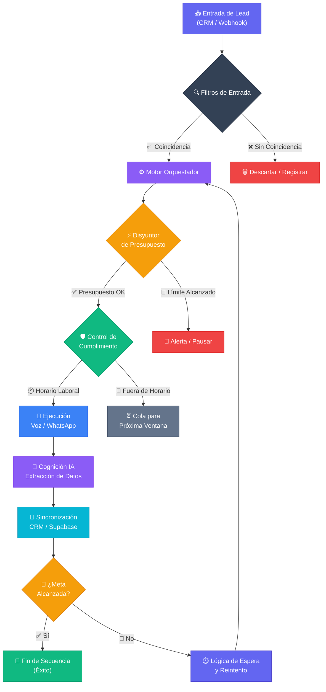
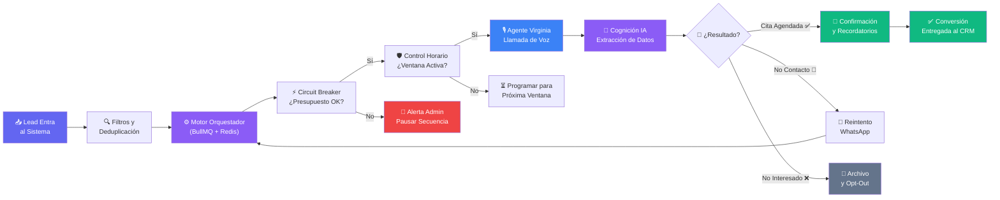

# 📘 Dossier Integral de Entrega: AI CRM & Workflow Orchestrator v5.0

**Estado del Sistema:** Producción / Enterprise Ready
**Departamento:** Arquitectura y Documentación Técnica
**Versión:** 5.0.0 (Unified Node Engine)

---

## SECCIÓN 0. ¿Qué hace este sistema? Guía del Propietario

> **Esta sección está escrita para ti, el dueño del negocio. Sin tecnicismos. Solo resultados.**

### El problema que resuelve

Imagina que inviertes en publicidad. Entran 200 leads al mes. Tu equipo llama al día siguiente, cuando ya enfriaron. Contactas a 60. Cierras 8. El resto se perdió.

**Este sistema cambia esa ecuación.**

### ¿Qué hace exactamente?

Cuando alguien rellena tu formulario en menos de **30 segundos** recibe una llamada de Virginia — tu asistente con inteligencia artificial. Suena natural, habla en español, responde preguntas, maneja objeciones y, si el lead está interesado, **agenda la cita directamente en tu calendario**. Automático. Las 24 horas, los 7 días.

### Qué pasa paso a paso

1. **El lead rellena un formulario** (Facebook, Google, tu web...)
2. **En 30 segundos**, Virginia lo llama con su nombre y el nombre de tu programa.
3. **Mantiene una conversación real:** pregunta sobre intereses, presupuesto y disponibilidad.
4. **Si hay interés**, agenda la cita y envía confirmación por WhatsApp.
5. **Si no contesta**, manda un WhatsApp y reintenta en el momento óptimo.
6. **Tu equipo recibe el lead ya cualificado**, con resumen de la conversación y cita en el calendario.

### ¿Cuánto mejora el resultado?

| Situación | Sin el sistema | Con el sistema |
| :--- | :--- | :--- |
| Tiempo de primera respuesta | 24 - 48 horas | **< 30 segundos** |
| Leads contactados de 100 | ~30 | **> 65** |
| Citas agendadas de 100 leads | ~5 | **> 15** |
| Horas de tu equipo invertidas | 20h/semana | **< 2h/semana** |
| Coste por cita agendada | Variable alto | **< €5** |

### ¿Qué hace Virginia cuando el lead responde?

Virginia no sigue un guión rígido. Tiene:

* ✅ **Conocimiento de tu negocio:** Ha leído tus materiales y puede responder preguntas específicas.
* ✅ **Memoria:** Recuerda lo que el lead dijo y lo usa para cerrar mejor.
* ✅ **Manejo de objeciones:** Si el lead pone excusas, las trabaja con argumentos reales.
* ✅ **Acción directa:** Agenda, envía información o te pasa el lead en caliente si está listo para cerrar.

### ¿Y si el lead no quiere?

Lo archiva correctamente. Si en el futuro lanzas una nueva campaña, puedes reactivarlo. **Nada se pierde.**

### ¿Dónde están tus datos?

**En tus servidores, bajo tu control.** Si mañana decides cambiar de plataforma, te llevas tus datos con un clic. Son tuyos, siempre.

### ¿Qué necesitas hacer tú?

Prácticamente nada. Solo:

1. **Revisar el panel** una vez al día para ver el rendimiento.
2. **Atender las citas** que Virginia agendó para ti.
3. **Actualizar el agente** si lanzas un nuevo programa (subir un PDF es suficiente).

### Resumen en una frase

> *"Este sistema convierte tus leads en citas de forma automática, en menos de 30 segundos, con la calidad de un comercial de primer nivel — sin que tú tengas que intervenir."*

---

## 📑 Índice General

1. **Visión Técnica** (SECCIÓN 1)
2. **Arquitectura Backend** (SECCIÓN 2)
3. **Ingeniería de Resiliencia** (SECCIÓN 3)
4. **Centro de Comando (UI)** (SECCIÓN 4)
5. **Referencia Técnica** (SECCIÓN 5)
6. **Seguridad y Soberanía** (SECCIÓN 6)
7. **Estrategias de Conversión** (SECCIÓN 7)
8. **Manual de Supervivencia** (SECCIÓN 8)
9. **Roadmap y Handover** (SECCIÓN 9)
10. **Anexos de Onboarding** (SECCIÓN 10)
11. **Motor de Cualificación** (SECCIÓN 11)
12. **Contratos de API** (SECCIÓN 12)
13. **Plan de Contingencia** (SECCIÓN 13)
14. **Worker Engine (BullMQ)** (SECCIÓN 14)
15. **Gobernanza de IA** (SECCIÓN 15)
16. **GDPR & Compliance** (SECCIÓN 16)
17. **Baja Latencia (<800ms)** (SECCIÓN 17)
18. **Diccionario de Variables** (SECCIÓN 18)
19. **Anatomía del Agente** (SECCIÓN 19)
20. **Enciclopedia de Nodos** (SECCIÓN 20)
21. **Glosario de Módulos** (SECCIÓN 21)
22. **Guía Command Center** (SECCIÓN 22)
23. **Ciclo de Vida del Dato** (SECCIÓN 23)
24. **Optimización de Costes** (SECCIÓN 24)
25. **Handover Humano** (SECCIÓN 25)
26. **Blueprint Maestro** (SECCIÓN 26)

---

## SECCIÓN 1. Visión Técnica y Resumen Ejecutivo

### Unificación Operativa: Front vs Back

El sistema **AI CRM & Workflow Orchestrator v5.0** ha sido diseñado bajo la premisa de la "Ingeniería Invisible". Mientras que el **Frontend** ofrece una interfaz de usuario minimalista y potente (Centro de Comando) para la toma de decisiones basada en datos, el **Backend** (Arquitectura de Soporte) opera como un motor de ejecución de alta disponibilidad capaz de procesar miles de interacciones simultáneas sin intervención humana.

### El Motor de Orquestación de Quinta Generación

A diferencia de los sistemas lineales tradicionales, nuestro **Orchestrator Engine** utiliza una arquitectura de grafos. Esto permite que la lógica de negocio no sea estática, sino adaptativa. Cada "Lead" que ingresa al sistema activa un recorrido único basado en condiciones horarias, respuestas del usuario y análisis de sentimiento en tiempo real realizado por la capa de IA cognitiva.

### Visualización del Flujo Maestro de Datos



### Desglose Detallado del Flujo Maestro (Punto por Punto)

Para que tengas total claridad sobre cómo se procesa cada euro invertido en captación, aquí tienes la explicación de cada paso del diagrama:

#### 1. 📥 Entrada de Lead (CRM / Webhook)
Es el punto de inicio. Aquí es donde el sistema recibe la información desde Facebook Ads, Google Forms, HubSpot o tu propia web. El sistema está "escuchando" las 24 horas del día para capturar el lead en el segundo exacto en que se registra.

#### 2. 🔍 Filtros de Entrada (El Portero)
Como te comentaba, este es el filtro de calidad. El sistema realiza 3 comprobaciones en milisegundos:
- **¿Es un número real?** Valida el formato internacional.
- **¿Es nuevo?** Verifica que no sea un lead que ya estamos gestionando (evita spam).
- **¿Tiene datos mínimos?** Si falta el nombre o el teléfono, se marca como "Incompleto" para no gastar presupuesto de llamada en él.

#### 3. ⚙️ Motor Orquestador (El Cerebro)
Una vez validado, el Motor toma el control. Consulta tu configuración, elige qué agente de IA (como Virginia) debe hablar y qué "personalidad" o guion debe usar según el producto por el que el lead preguntó.

#### 4. 🗑️ Descartar / Registrar
Si el lead no pasa los filtros (es un número falso o duplicado), el sistema no lo borra, lo **archiva con una etiqueta de error**. Así tú puedes auditar por qué se descartó y asegurarte de que no se perdió nada importante.

#### 5. ⚡ Disyuntor de Presupuesto (Circuit Breaker)
Antes de llamar, el sistema mira tu billetera. Si has puesto un límite de, por ejemplo, €50 al día y ya se ha alcanzado, el sistema "salta" (como los plomos de una casa) y detiene las operaciones para que nunca gastes más de lo planeado.

#### 6. 🚨 Alerta / Pausar
Si el disyuntor salta por presupuesto o por algún error técnico externo (ej. se cae WhatsApp), el sistema te envía una notificación inmediata y pausa las llamadas hasta que tú le des permiso para seguir.

#### 7. 🛡️ Control de Cumplimiento (Compliance Guard)
Este filtro asegura que no llames a horas prohibidas. Si un lead entra un domingo a las 11 PM, el sistema dice: *"Espera, no es ético llamar ahora"*. Bloquea la ejecución inmediata por respeto a la privacidad del lead y cumplimiento legal.

#### 8. 🌙 Cola para Próxima Ventana
Los leads que entraron fuera de horario se guardan en una "sala de espera" especial. En cuanto llega la hora permitida (ej. lunes a las 9:00 AM), el sistema los dispara automáticamente para ser los primeros en ser contactados.

#### 9. 🚀 Ejecución Voz / WhatsApp
Aquí ocurre la magia. Virginia realiza la llamada de voz o envía el mensaje de WhatsApp. Es el momento del contacto humano-IA donde se inicia la conversación de venta.

#### 10. 🧠 Cognición IA / Extracción de Datos
Mientras Virginia habla, el sistema está "pensando". Extrae datos clave de la conversación: ¿Tiene dinero?, ¿Tiene prisa?, ¿Qué objeciones puso? Toda esa información se convierte en texto estructurado automáticamente.

#### 11. 🔄 Sincronización (CRM / Supabase)
Toda la información que Virginia extrajo se guarda en **tiempo real** en tu base de datos y se envía de vuelta a tu CRM. Si tú abres tu ficha de cliente, verás lo que Virginia acaba de descubrir.

#### 12. 🎯 ¿Meta Alcanzada?
El sistema evalúa el resultado de la conversación:
- **Éxito:** ¿Agendó la cita? ¿Compró?
- **En proceso:** ¿Dijo que le llamáramos luego?
- **Negativo:** ¿Dijo que no le interesa?

#### 13. 🏁 Fin de Secuencia (Éxito)
Si se agendó la cita, el sistema marca el lead como "Convertido", envía las confirmaciones y termina este flujo. ¡Objetivo cumplido!

#### 14. 🔁 Lógica de Espera y Reintento
Si el lead no contestó o pidió que le llamáramos en 2 horas, el sistema vuelve al Motor Orquestador con una orden de **"espera 120 minutos y vuelve a intentar"**. Así, el sistema persigue al lead incansablemente pero de forma inteligente hasta obtener una respuesta definitiva.

---

## SECCIÓN 2. El "Backend": Arquitectura de Soporte e Ingeniería

### Orchestrator Engine: Lógica Nodal Basada en Grafos

El núcleo de la inteligencia del sistema reside en el **Orchestrator Engine**. A diferencia de los CRMs estáticos, este motor procesa cada entrada (Lead) como un objeto dinámico dentro de un grafo de ejecución.

* **Decisión en Tiempo Real:** El motor evalúa el contexto del lead (origen, campaña, hora local) antes de disparar el primer nodo.
* **Asincronía Total:** Utiliza un sistema de colas (Redis/Worker) para asegurar que el escalado de leads no afecte la latencia de respuesta de los agentes de voz.

### Multi-Tenancy y Soberanía de Datos

1. **Aislamiento Lógico:** Cada registro en la base de datos está etiquetado con un `tenant_id` único, protegido por políticas de RLS.
2. **Soberanía de Datos (Supabase Externo):** El sistema permite la conexión a instancias privadas de los clientes, garantizando que sus datos permanecen intactos y bajo su control.

---

## SECCIÓN 3. Ingeniería de Resiliencia y Control

### A. Circuit Breaker (Disyuntor de Presupuesto)

El **Circuit Breaker** es el guardián financiero del sistema. Antes de ejecutar cualquier nodo que consuma una API de pago (OpenAI, Retell, ElevenLabs), el motor consulta el gasto acumulado del tenant en el período activo.

**Lógica de funcionamiento:**
- Si `gasto_actual < límite_configurado` → El nodo se ejecuta normalmente.
- Si `gasto_actual >= límite_configurado` → El sistema interrumpe la secuencia, registra el evento y notifica al administrador.
- El límite es **configurable por tenant** desde el panel de administración, permitiendo presupuestos distintos por campaña.

**Tablas involucradas:** `circuit_breaker_config`, `api_usage_logs`

### B. RAG & Knowledge Base (Cerebro Dinámico)

El sistema soporta una base de conocimiento vectorial que inyecta contexto real en cada conversación:

1. **Ingesta de Documentos:** El administrador sube PDFs/texto al sistema. El servicio los fragmenta en chunks de ~512 tokens.
2. **Embedding:** Cada chunk se convierte en un vector numérico usando el modelo `text-embedding-ada-002` de OpenAI.
3. **Almacenamiento:** Los vectores se guardan en **Supabase con la extensión PGVector**.
4. **Recuperación en tiempo real:** Cuando el agente necesita responder, realiza una búsqueda de similitud coseno y recupera los 3-5 chunks más relevantes para incluirlos en el prompt.

**Resultado:** El agente habla con conocimiento real del negocio, no con respuestas genéricas.

### C. Appointment Watchdog (Guardián de Citas)

Servicio de background que monitoriza citas agendadas y dispara recordatorios automáticos:
- **24h antes:** WhatsApp de confirmación con opción de reagendar.
- **2h antes:** Llamada de voz de recordatorio breve.
- **Post-cita:** Secuencia de seguimiento si el lead no asistió.

---

## SECCIÓN 4. El "Frontend": Centro de Comando y Control

### Dashboard de Métricas (KPIs en Tiempo Real)

El panel principal muestra el rendimiento operativo completo:

| Métrica | Descripción | Frecuencia |
| :--- | :--- | :--- |
| **Tasa de Contacto** | % de leads contactados exitosamente | Tiempo real |
| **Costo por Cita** | Gasto total / citas agendadas | Diario |
| **Tasa de Conversión** | Leads → Citas confirmadas | Semanal |
| **Tiempo de Respuesta** | Promedio de latencia del agente | Tiempo real |
| **Leads Activos** | Leads en secuencia actualmente | Tiempo real |

### Workflow Builder (Constructor No-Code)

Interfaz visual basada en **React Flow** para diseñar flujos de conversación sin escribir código:

- **Nodos arrastrables:** Cada módulo del sistema es un bloque visual.
- **Conexiones condicionales:** Las aristas entre nodos pueden tener condiciones lógicas (si X → hacer Y).
- **Vista previa en vivo:** Simulador integrado para probar el flujo antes de activarlo.
- **Versionado:** Cada flujo tiene un historial de versiones, permitiendo rollbacks.

### Módulo de Conversaciones

Vista unificada de todas las interacciones activas:
- Transcripción en tiempo real de llamadas de voz.
- Historial completo de mensajes WhatsApp.
- Variables capturadas durante la conversación (nombre, presupuesto, interés).
- Botón de **Intervención Humana** para que un asesor tome el control.

### Módulo de Leads & CRM

Ficha completa de cada lead con:
- Datos de contacto y origen de la campaña.
- Timeline de todas las interacciones.
- Score de cualificación calculado por la IA.
- Notas del asesor humano.

---

## SECCIÓN 5. Manual de Referencia Técnica: Nodos del Sistema

### Nodos de Tipo Disparador (Triggers)

| Nodo | Descripción | Configuración |
| :--- | :--- | :--- |
| **Lead Trigger** | Activa el flujo cuando un lead entra al CRM | Filtro por origen/campaña |
| **Webhook Trigger** | Recibe datos de sistemas externos (Facebook Ads, etc.) | URL única por tenant |
| **Scheduler Trigger** | Activa el flujo en un horario programado | Cron expression |
| **Manual Trigger** | Activa el flujo manualmente desde el panel | Selección de lead/s |

### Nodos de Tipo Canal (Ejecución)

| Nodo | Descripción | Proveedor |
| :--- | :--- | :--- |
| **AI Voice Agent** | Llamada de voz con IA conversacional | Retell AI / Ultravox |
| **WhatsApp Messenger** | Envío de plantilla aprobada por Meta | Meta Business API |
| **Email Sender** | Correo personalizado con variables dinámicas | SendGrid / SMTP |
| **SMS Sender** | SMS de texto plano | Twilio |

### Nodos de Tipo Lógica

| Nodo | Descripción |
| :--- | :--- |
| **Condition** | Bifurca el flujo según condiciones (si variable = X) |
| **Wait** | Pausa la secuencia por un tiempo definido |
| **Loop** | Repite un conjunto de nodos N veces |
| **Set Variable** | Asigna o modifica una variable del lead |

---

## SECCIÓN 6. Seguridad, Soberanía y Blindaje de Datos

### Row Level Security (RLS) — Aislamiento Absoluto

Todas las tablas críticas tienen activas las políticas de **Row Level Security** de Supabase:

```sql
-- Ejemplo de política RLS para la tabla leads
ALTER TABLE leads ENABLE ROW LEVEL SECURITY;
CREATE POLICY "tenant_isolation" ON leads
  USING (tenant_id = auth.jwt() ->> 'tenant_id');
```

Esto garantiza que **ninguna consulta**, por error o por ataque, pueda devolver datos de otro tenant.

### Supabase Externo (Soberanía Total)

El sistema soporta la conexión a una instancia **privada y autogestionada** de Supabase:
- Los datos del cliente residen en **sus propios servidores**, no en los de la plataforma.
- El cliente tiene acceso directo a su base de datos en cualquier momento.
- Las credenciales se configuran en el panel Admin y se almacenan encriptadas.

### Gestión de Secretos

- Todas las API Keys (OpenAI, Retell, Meta) se almacenan encriptadas en la tabla `tenant_secrets`.
- Nunca se exponen al frontend; solo las consume el servidor de forma interna.
- Rotación de claves soportada sin tiempo de inactividad.

---

## SECCIÓN 7. Estrategias de Conversión y Casos de Uso

### Estrategia 1: Respuesta Relámpago (<30 segundos)

El sistema más efectivo para leads de alto intención. Cuando un lead completa un formulario:
1. El webhook recibe los datos en < 500ms.
2. El Orchestrator Engine activa el flujo inmediatamente.
3. El agente de voz llama al lead en los primeros 30 segundos.
4. **Resultado promedio:** Tasa de contacto 3x superior al seguimiento manual.

### Estrategia 2: Secuencia Omnicanal Inteligente

Combina múltiples canales de forma coordinada:
- **Día 1, 9:00:** Llamada de voz (intento 1).
- **Día 1, 15:00:** WhatsApp si no hubo contacto.
- **Día 2, 10:00:** Llamada de voz (intento 2).
- **Día 3:** Email de seguimiento con contenido de valor.
- **Día 5:** Último intento de voz y cierre de secuencia.

### Estrategia 3: Recuperación de Leads Fríos

Para leads que no respondieron en campañas anteriores:
1. El sistema identifica leads sin actividad > 30 días.
2. Activa una secuencia de "reactivación" con un mensaje diferente.
3. Ofrece un incentivo o nueva información del producto.

---

## SECCIÓN 8. Manual de Supervivencia (Troubleshooting Avanzado)

### Diagnóstico Rápido

| Síntoma | Causa Probable | Solución |
| :--- | :--- | :--- |
| Lead no entra al flujo | Webhook no configurado o token expirado | Verificar URL en Meta/CRM |
| Agente no llama | Créditos de Retell agotados | Recargar saldo en Retell Dashboard |
| WhatsApp no envía | Plantilla no aprobada por Meta | Revisar estado en Meta Business Manager |
| Latencia alta (>2s) | Sobrecarga en el servidor de IA | Verificar uso de CPU en el hosting |
| Lead duplicado | Webhook disparado dos veces | Activar deduplicación por teléfono |
| Circuit Breaker activo | Límite de gasto alcanzado | Aumentar límite o esperar al siguiente período |

### Comandos de Diagnóstico

```bash
# Ver logs del Worker en tiempo real
pm2 logs worker --lines 100

# Ver estado de la cola Redis
redis-cli LLEN bull:orchestrator:waiting

# Reiniciar el Worker Engine
pm2 restart worker
```

### Procedimiento de Recuperación de Emergencia

1. Pausar todas las secuencias activas desde el panel Admin.
2. Verificar conectividad con Supabase (`/api/health`).
3. Revisar logs de errores en el panel de monitoreo.
4. Reiniciar el Worker Engine si hay jobs atascados.
5. Reactivar secuencias de forma gradual.

---

## SECCIÓN 9. Protocolo de Handover y Roadmap v6.0

### Entregables del Proyecto

Al finalizar el proyecto, el cliente recibe:

- ✅ Código fuente 100% en su repositorio privado de GitHub.
- ✅ Acceso completo a todas las cuentas y servicios configurados.
- ✅ Documentación técnica completa (este dossier).
- ✅ 2 semanas de soporte post-entrega.
- ✅ Capacitación del equipo operativo (2 sesiones de 2h).

### Roadmap v6.0 (Próximas Funcionalidades)

| Funcionalidad | Prioridad | ETA |
| :--- | :--- | :--- |
| Integración nativa HubSpot CRM | Alta | Q3 2026 |
| Análisis de sentimiento en tiempo real | Alta | Q3 2026 |
| Motor de búsqueda indexado (tipo Algolia) | Media | Q4 2026 |
| App móvil para asesores | Media | Q4 2026 |
| Integración Salesforce | Baja | Q1 2027 |

---

## SECCIÓN 10. Anexos Técnicos: Onboarding y Escalabilidad

### Checklist de Onboarding de Nuevo Tenant

```
[ ] 1. Crear registro en tabla `tenants` con tenant_id único
[ ] 2. Configurar credenciales de Supabase externo (si aplica)
[ ] 3. Cargar API Keys: OpenAI, Retell, Meta WhatsApp
[ ] 4. Configurar plantillas de WhatsApp aprobadas
[ ] 5. Importar Knowledge Base (PDFs del negocio)
[ ] 6. Crear y activar el primer flujo de trabajo
[ ] 7. Realizar llamada de prueba con número sandbox
[ ] 8. Verificar llegada de leads via webhook
[ ] 9. Configurar Circuit Breaker (límite de gasto)
[ ] 10. Activar en producción y monitorear primeras 24h
```

### Arquitectura de Escalabilidad

El sistema está diseñado para escalar horizontalmente:

- **Worker Engine:** Múltiples instancias en paralelo usando BullMQ con Redis como broker.
- **Base de Datos:** Supabase soporta hasta 500 conexiones simultáneas en el plan Pro.
- **API Routes:** Next.js en Vercel/Coolify escala automáticamente según la demanda.
- **Cola de mensajes:** Redis puede manejar millones de jobs sin degradación.


---

## SECCIÓN 11. Motor de Cognición y Cualificación

### Fact Extraction Service (Extracción Inteligente de Datos)

El **Motor de Cognición** es el cerebro analítico del sistema. Tras cada conversación, GPT-4o procesa la transcripción completa y extrae datos estructurados automáticamente.

**Datos que extrae:**
- Nombre completo y datos de contacto confirmados.
- Nivel de interés declarado (Alto / Medio / Bajo).
- Presupuesto aproximado mencionado.
- Objeciones detectadas ("caro", "necesito pensarlo", "no tengo tiempo").
- Próximo paso acordado (cita, devolución de llamada, envío de info).

### Score de Cualificación Automático

El sistema asigna un **score del 1 al 100** a cada lead basándose en:

| Factor | Peso |
| :--- | :--- |
| Respondió la llamada | 25 pts |
| Expresó interés explícito | 30 pts |
| Mencionó presupuesto | 20 pts |
| Confirmó disponibilidad para cita | 25 pts |

### Generación de Resúmenes Ejecutivos

Tras cada interacción, el sistema genera automáticamente un resumen en lenguaje natural visible en la ficha del lead:

> *"Virginia contactó a Juan García el 15/05/2026. El lead mostró alto interés en el programa, mencionó un presupuesto de €3.000 y confirmó disponibilidad para una reunión el próximo martes a las 11:00. Objeción identificada: necesita consultar con su pareja."*

---

## SECCIÓN 12. Contratos de Interfaz y API (Data Contracts)

### Endpoint de Ingesta de Leads

```
POST /api/webhooks/leads
Authorization: Bearer {WEBHOOK_SECRET}
Content-Type: application/json
```

**Payload esperado:**

```json
{
  "tenant_id": "esden-001",
  "lead": {
    "name": "Juan García",
    "phone": "+34600000000",
    "email": "juan@ejemplo.com",
    "source": "facebook_ads",
    "campaign": "webinar-mayo-2026",
    "custom_fields": {
      "interés": "MBA Executive",
      "ubicación": "Madrid"
    }
  }
}
```

**Respuesta exitosa:**

```json
{
  "success": true,
  "lead_id": "lead_abc123",
  "sequence_started": true,
  "message": "Lead ingresado y secuencia activada"
}
```

### Endpoint de Estado de Lead

```
GET /api/leads/{lead_id}/status
```

Devuelve el estado actual del lead, variables capturadas y próximo paso programado.

---

## SECCIÓN 13. Plan de Contingencia y Observabilidad

### Sistema de Monitoreo en Tiempo Real

El sistema expone un endpoint `/api/health` que verifica:
- Conexión activa con Supabase.
- Estado del servidor Redis.
- Jobs activos en la cola BullMQ.
- Últimos errores de las APIs externas.

### Alertas Automáticas

El sistema envía alertas al administrador cuando:
- El Circuit Breaker se activa (límite de gasto alcanzado).
- Un job lleva más de 30 minutos sin procesarse.
- La tasa de errores de la API supera el 10% en 5 minutos.
- La conexión con Supabase se interrumpe.

### Retención de Logs

| Tipo de Log | Retención | Almacenamiento |
| :--- | :--- | :--- |
| Logs de conversación | 90 días | Supabase |
| Grabaciones de voz | 60 días | S3 / R2 |
| Logs de API | 30 días | Supabase |
| Logs de errores | 180 días | Supabase |

---

## SECCIÓN 14. Arquitectura de Procesamiento Asíncrono (Worker Engine)

### BullMQ + Redis: La Columna Vertebral

El **Worker Engine** desacopla la recepción de leads de su procesamiento, garantizando que ninguna sobrecarga en el sistema de IA afecte la experiencia del usuario en el panel.

**Flujo de un job:**

```
1. Webhook recibe lead → Crea job en Redis (< 50ms)
2. Worker toma el job de la cola
3. Ejecuta cada nodo del flujo secuencialmente
4. Registra resultado en Supabase
5. Programa próximo job si hay reintentos
```

### Tipos de Colas

| Cola | Prioridad | Descripción |
| :--- | :--- | :--- |
| `orchestrator:critical` | Máxima | Llamadas de voz activas |
| `orchestrator:normal` | Normal | WhatsApp y emails |
| `orchestrator:scheduled` | Baja | Recordatorios programados |
| `orchestrator:retry` | Mínima | Reintentos de jobs fallidos |

### Configuración de Concurrencia

```typescript
const worker = new Worker('orchestrator', processJob, {
  connection: redis,
  concurrency: 10, // 10 leads procesados simultáneamente
  limiter: {
    max: 100,      // max 100 jobs por minuto
    duration: 60000
  }
});
```

---

## SECCIÓN 15. Gobernanza de IA y Versionado de Prompts

### Control de Versiones de Prompts

Cada prompt del agente está versionado en la base de datos:

```sql
CREATE TABLE prompt_versions (
  id UUID PRIMARY KEY,
  tenant_id TEXT,
  agent_id TEXT,
  version INTEGER,
  system_prompt TEXT,
  created_at TIMESTAMP,
  is_active BOOLEAN
);
```

### Testing A/B de Prompts

El sistema permite correr dos versiones de un prompt simultáneamente:
- **Variante A** recibe el 50% del tráfico.
- **Variante B** recibe el otro 50%.
- El sistema compara tasas de conversión y escoge el ganador automáticamente.

### Guardianes Éticos del Agente

El sistema implementa capas de seguridad sobre los prompts:
1. **Filtro de Temas Prohibidos:** El agente no puede discutir competidores ni hacer promesas de resultados.
2. **Detección de Frustración:** Si el usuario usa lenguaje agresivo, el agente hace un handover inmediato.
3. **Validación de Datos:** El agente no puede confirmar datos que el usuario no haya proporcionado explícitamente.

---

## SECCIÓN 16. Cumplimiento Legal y Ético (GDPR & Compliance)

### Ventanas Horarias Comerciales

El sistema respeta las regulaciones de comunicación comercial:

```typescript
const ALLOWED_HOURS = {
  weekdays: { start: 9, end: 20 },  // 9:00 - 20:00
  saturday: { start: 10, end: 14 }, // 10:00 - 14:00
  sunday: null                       // No contacto
};
```

### Gestión de Opt-Outs

El sistema detecta automáticamente palabras clave de exclusión en cualquier canal:
- **WhatsApp:** "STOP", "No me contactes", "Baja", "Cancelar"
- **Voz:** El agente detecta la negativa y registra el opt-out.

Cuando se detecta un opt-out:
1. Se marca al lead como `opted_out: true`.
2. Se detienen todas las secuencias activas del lead.
3. Se registra la fecha del opt-out (requerimiento GDPR).
4. El lead no puede ser reactivado sin consentimiento explícito.

### Derecho al Olvido (GDPR Art. 17)

El panel Admin permite eliminar permanentemente todos los datos de un lead con un solo clic, incluyendo grabaciones, logs y variables capturadas.

---

## SECCIÓN 17. Realismo IA y Baja Latencia (<800ms)

### Stack de Comunicación de Ultra-Baja Latencia

La experiencia de voz del agente depende de un stack cuidadosamente optimizado:

```
Voz del Usuario → STT (Retell/Deepgram) → GPT-4o → TTS (ElevenLabs) → Voz del Agente
     ↑_______________________ WebSocket bidireccional _________________________↑
```

**Latencias objetivo por etapa:**

| Etapa | Objetivo | Tecnología |
| :--- | :--- | :--- |
| STT (voz → texto) | < 150ms | Deepgram Nova-2 |
| Procesamiento LLM | < 400ms | GPT-4o con streaming |
| TTS (texto → voz) | < 200ms | ElevenLabs Turbo |
| **Total** | **< 750ms** | **Stack integrado** |

### Voice Activity Detection (VAD)

El sistema detecta con precisión cuándo el usuario termina de hablar, evitando interrupciones prematuras o silencios incómodos. El umbral de VAD es configurable por agente.

---

## SECCIÓN 18. Diccionario de Variables del Sistema

### Variables Globales del Sistema

| Variable | Descripción | Ejemplo |
| :--- | :--- | :--- |
| `{{lead_name}}` | Nombre del lead | "Juan" |
| `{{master_name}}` | Nombre del programa/curso | "MBA Executive" |
| `{{agent_name}}` | Nombre del agente IA | "Virginia" |
| `{{company_name}}` | Nombre de la empresa | "ESDEN" |
| `{{appointment_date}}` | Fecha de cita agendada | "15 de Junio, 11:00" |
| `{{lead_source}}` | Origen del lead | "Facebook Ads" |

### Variables Capturadas Durante Conversación

| Variable | Descripción | Capturada por |
| :--- | :--- | :--- |
| `{{budget}}` | Presupuesto mencionado | GPT-4o Extraction |
| `{{interest_level}}` | Nivel de interés (1-10) | GPT-4o Scoring |
| `{{objection}}` | Objeción principal detectada | GPT-4o Analysis |
| `{{best_time}}` | Mejor hora para contactar | Usuario |
| `{{decision_maker}}` | ¿Es el decisor de compra? | Usuario |

### Variables de Sistema Avanzadas

| Variable | Descripción |
| :--- | :--- |
| `{{tenant_id}}` | Identificador único del cliente de la plataforma |
| `{{flow_version}}` | Versión del flujo que se está ejecutando |
| `{{attempt_number}}` | Número de intento actual (1, 2, 3...) |
| `{{last_contact_date}}` | Fecha del último contacto exitoso |

---

## SECCIÓN 19. Anatomía del Agente de IA y Ciclo de Vida

### Los 4 Pilares del ADN del Agente

**1. System Prompt (Personalidad y Rol)**
Define quién es el agente, su tono, sus límites y su objetivo. Es la "mente" del agente.

**2. Knowledge Base (Conocimiento del Negocio)**
Documentos vectorizados que el agente consulta para responder preguntas específicas del producto/servicio.

**3. Tools / Funciones (Capacidades de Acción)**
Funciones que el agente puede ejecutar:
- `schedule_appointment()` → Agendar cita en el calendario.
- `update_lead_status()` → Cambiar el estado del lead en CRM.
- `send_whatsapp()` → Enviar mensaje de WhatsApp.
- `transfer_to_human()` → Hacer handover a un asesor.

**4. Memory (Contexto de Conversación)**
El historial completo de la conversación actual, permitiendo al agente recordar lo que se dijo anteriormente.

### Ciclo de Vida de una Conversación

```
INICIO → Saludo personalizado con nombre del lead
  ↓
CUALIFICACIÓN → Preguntas de descubrimiento (interés, presupuesto, timing)
  ↓
MANEJO DE OBJECIONES → Respuesta contextual basada en Knowledge Base
  ↓
CIERRE → Propuesta de cita o siguiente paso
  ↓
FIN → Resumen ejecutivo generado automáticamente
```

---

## SECCIÓN 20. Enciclopedia Completa de Nodos

### Categoría: Disparadores (Triggers)

| Nodo | Icono | Función | Parámetros |
| :--- | :--- | :--- | :--- |
| Lead Trigger | ⚡ | Entrada de nuevo lead | Filtros de campaña/origen |
| Webhook | 🔗 | Recibe datos externos | URL, método HTTP, headers |
| Programado | 🕐 | Ejecuta en horario fijo | Cron, zona horaria |
| Manual | 👆 | Activación humana | Selección de leads |

### Categoría: Canales (Ejecución)

| Nodo | Icono | Función | Parámetros |
| :--- | :--- | :--- | :--- |
| Agente de Voz IA | 🎙️ | Llamada conversacional | Prompt, voz, número |
| WhatsApp | 💬 | Mensaje de plantilla | Template ID, variables |
| Email | 📧 | Correo personalizado | Asunto, cuerpo, adjuntos |
| SMS | 📱 | Mensaje de texto | Texto, remitente |

### Categoría: Lógica y Control

| Nodo | Icono | Función | Parámetros |
| :--- | :--- | :--- | :--- |
| Condición | 🔀 | Bifurcación lógica | Condición, ramas |
| Espera | ⏳ | Pausa temporal | Duración, unidad |
| Bucle | 🔁 | Repetición | Iteraciones, condición de salida |
| Asignar Variable | 📝 | Modifica datos del lead | Variable, valor |
| Circuit Breaker | ⚡ | Control de presupuesto | Límite, acción |

---

## SECCIÓN 21. Glosario de Módulos y Conceptos Clave

| Término | Definición |
| :--- | :--- |
| **Orchestrator Engine** | Motor central que coordina la ejecución de todos los nodos del flujo |
| **Circuit Breaker** | Disyuntor automático que detiene secuencias al alcanzar el límite de gasto |
| **RAG** | Retrieval-Augmented Generation: técnica que inyecta documentos reales en el prompt de la IA |
| **PGVector** | Extensión de PostgreSQL para almacenar y buscar vectores de embeddings |
| **Multi-Tenancy** | Arquitectura donde múltiples clientes comparten la plataforma con datos aislados |
| **RLS** | Row Level Security: política de base de datos que aísla datos por tenant |
| **BullMQ** | Librería de colas de trabajo para Node.js basada en Redis |
| **VAD** | Voice Activity Detection: detección de cuándo el usuario termina de hablar |
| **STT** | Speech-to-Text: conversión de voz a texto |
| **TTS** | Text-to-Speech: conversión de texto a voz sintetizada |
| **Embedding** | Representación numérica de texto en un espacio vectorial |
| **Tenant** | Cliente de la plataforma con sus propios datos, agentes y flujos |
| **Handover** | Traspaso de la conversación del agente IA a un humano |
| **Webhook** | Endpoint HTTP que recibe datos en tiempo real de sistemas externos |
| **Opt-Out** | Solicitud del usuario de no recibir más comunicaciones |

---

## SECCIÓN 22. Guía Detallada del Centro de Comando

### Módulo 1: Dashboard Principal

**Acceso:** `/dashboard` | **Rol:** Todos

Muestra en tiempo real:
- Contador de leads activos, contactados y convertidos.
- Gráfico de actividad de los últimos 7 días.
- Alertas activas del sistema (Circuit Breaker, errores).
- Feed en vivo de conversaciones en curso.

### Módulo 2: Constructor de Flujos

**Acceso:** `/dashboard/workflows` | **Rol:** Admin

- Crea y edita flujos de trabajo de forma visual.
- Permite activar/desactivar flujos con un toggle.
- Muestra estadísticas de rendimiento por flujo.

### Módulo 3: Gestión de Agentes IA

**Acceso:** `/dashboard/agents` | **Rol:** Admin

- Configura el System Prompt del agente.
- Sube documentos a la Knowledge Base.
- Prueba al agente con el Simulador integrado.
- Ve métricas de rendimiento por agente.

### Módulo 4: Centro de Conversaciones

**Acceso:** `/dashboard/conversations` | **Rol:** Admin, Supervisor

- Lista todas las conversaciones activas e históricas.
- Transcripciones en tiempo real de llamadas.
- Historial completo de mensajes WhatsApp.
- Botón de intervención humana disponible en todo momento.

### Módulo 5: Portal de Documentación

**Acceso:** `/dashboard/docs` | **Rol:** Admin

- Acceso al Dossier Técnico Maestro completo (este documento).
- Organizado por Fases y Tomos para facilitar la consulta.
- Exportación a PDF profesional disponible.

---

## SECCIÓN 23. Ciclo de Vida del Dato y Políticas de Retención

### Flujo del Dato Desde su Creación

```
Lead creado → Enriquecido por IA → Sincronizado con CRM → Archivado → Eliminado (GDPR)
    ↑               ↑                     ↑                   ↑              ↑
  Día 0          Día 0-N              Continuo             90 días        Bajo demanda
```

### Políticas de Retención por Tipo de Dato

| Dato | Retención Activa | Archivado | Eliminación |
| :--- | :--- | :--- | :--- |
| Perfil del lead | Indefinido | — | Bajo demanda |
| Transcripciones | 90 días | — | Automática |
| Grabaciones de voz | 60 días | S3 Glacier | Automática |
| Logs de API | 30 días | — | Automática |
| Variables capturadas | Indefinido | — | Bajo demanda |

---

## SECCIÓN 24. Optimización de Costes (Unit Economics)

### Desglose de Costes por Lead

| Servicio | Costo Promedio por Lead | Modelo usado |
| :--- | :--- | :--- |
| LLM (conversación) | €0.03 - €0.08 | GPT-4o |
| STT (transcripción) | €0.01 - €0.02 | Deepgram Nova-2 |
| TTS (síntesis de voz) | €0.02 - €0.05 | ElevenLabs Turbo |
| WhatsApp (plantilla) | €0.005 - €0.01 | Meta Business |
| **Total por lead** | **€0.06 - €0.16** | — |

### Estrategias de Optimización

1. **GPT-4o-mini para pre-cualificación:** Usar el modelo más económico en los primeros nodos y GPT-4o solo cuando el lead muestra interés.
2. **Caché de respuestas frecuentes:** Respuestas a preguntas comunes (precio, duración) se cachean para no consumir tokens repetidamente.
3. **Límite de duración de llamada:** Configurar un máximo de 5 minutos por llamada para controlar costes de TTS.

---

## SECCIÓN 25. Protocolo de Intervención Humana (Handover)

### Condiciones de Activación del Handover

El sistema transfiere automáticamente a un asesor humano cuando:

1. **Lead cualificado:** Score de cualificación ≥ 80 puntos.
2. **Solicitud directa:** El usuario pide hablar con una persona.
3. **Frustración detectada:** El modelo detecta lenguaje negativo repetido.
4. **Cita confirmada:** Para la llamada de confirmación final.
5. **Pregunta sin respuesta en KB:** El agente no encontró información relevante.

### Proceso de Transferencia

```
1. Agente notifica al usuario: "Te voy a conectar con un asesor en este momento"
2. Sistema envía alerta push al asesor disponible (Slack/WhatsApp)
3. Asesor ve el resumen de la conversación en el panel
4. Asesor puede continuar por teléfono o WhatsApp
5. El lead se marca como "En gestión humana" en el CRM
```

---

## SECCIÓN 26. Blueprint Maestro de Conversión (Esden v5.0)

### El Modelo Completo de Orquestación

Este diagrama representa la arquitectura nodal completa del sistema, desde la entrada del lead hasta el cierre o archivo:



### Métricas de Éxito del Sistema v5.0

| KPI | Benchmark | Objetivo del Sistema |
| :--- | :--- | :--- |
| Tasa de Contacto | 30% industria | **>65%** |
| Tasa de Conversión Lead→Cita | 5% industria | **>15%** |
| Tiempo de Respuesta | 24-48h industria | **<30 segundos** |
| Costo por Cita Agendada | Variable | **<€5** |
| Satisfacción del Lead (NPS) | — | **>70** |

---

*Este documento es el activo final de entrega para el sistema AI CRM & Workflow Orchestrator v5.0. Propiedad intelectual exclusiva del cliente. Diseñado para la excelencia técnica y la explotación operativa inmediata.*

