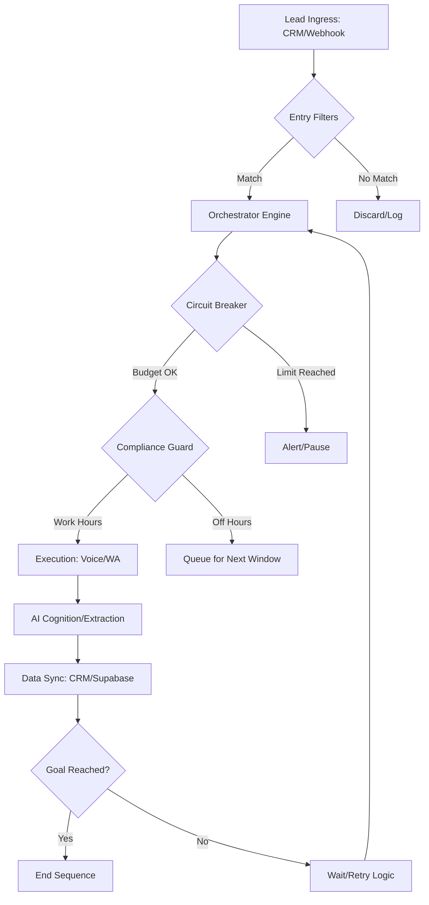

# 📘 Dossier Integral de Entrega: AI CRM & Workflow Orchestrator v5.0

**Estado del Sistema:** Producción / Enterprise Ready
**Departamento:** Arquitectura y Documentación Técnica
**Versión:** 5.0.0 (Unified Node Engine)

---

## 📑 Índice General

### 1. Visión Técnica y Resumen Ejecutivo

* Unificación Operativa: Front vs Back.
* Flujo Maestro de Datos (Diagrama).

### 2. El "Backend": Arquitectura de Soporte e Ingeniería

* **Orchestrator Engine:** Lógica nodal asíncrona.
* **Multi-Tenancy y Soberanía:** Supabase Externo.

### 3. Ingeniería de Resiliencia y Control (El "Fail-Safe")

* **Circuit Breaker:** Control de presupuestos en tiempo real.
* **RAG & Knowledge Base:** Inteligencia adaptativa basada en vectores.
* **Appointment Watchdog:** Automatización de recordatorios y recuperación.

### 4. El "Frontend": Centro de Comando y Control

* **Dashboard de Métricas:** KPIs y Funnels.
* **Workflow Builder:** Diseño nodal No-Code.
* **Admin Panel:** Gestión de APIs y Tenants.

### 5. Manual de Referencia Técnica (Tomo IV)

* Registro de Nodos y Diccionario de Variables.

### 6. Guía de Seguridad y Soberanía

* Blindaje RLS y Gestión de Service Role Keys.

### 7. Estrategias y Casos de Uso Ganadores

* Respuesta Relámpago, Insistencia Omnicanal y Cualificación.

### 8. Manual de Supervivencia (Troubleshooting)

* Protocolos de resolución por canal.

### 9. Protocolo de Handover y Roadmap v6.0

* Propiedad Intelectual y Futuro del Sistema.

### 10. Anexos Técnicos: Onboarding y Escalabilidad

* Checklist de despliegue y tabla de concurrencia.

### 11. Motor de Cognición y Cualificación

* Lógica de extracción de hechos y reglas de decisión.

### 12. Contratos de Interfaz y API (Data Contract)

* Estructura de Payloads y Sincronización CRM.

### 13. Plan de Contingencia y Observabilidad

* Monitoreo de salud y protocolos de recuperación.

### 14. Arquitectura de Procesamiento Asíncrono (The Worker Engine)

* Gestión de colas BullMQ, Redis y Cron Jobs.

### 15. Gobernanza de IA y Versionado de Prompts

* Control de variantes A/B y optimización de Cognición.

### 16. Cumplimiento Legal y Ético (GDPR & Compliance)

* Gestión de ventanas horarias, opt-outs y soberanía.

### 17. La "Joya de la Corona": Realismo Humano y Baja Latencia

* Ingeniería de <800ms y Streaming Bidireccional.

### 18. Diccionario de Variables del Sistema (Por Defecto)

* Mapeo de campos protegidos y variables de contexto.

### 19. Anatomía del Agente de IA y Ciclo de Vida

* Estructura de Prompting, Herramientas y Estados.

### 20. Enciclopedia de Nodos (The Nodal Encyclopedia)

* Referencia detallada de cada componente del Workflow Builder.

### 21. Glosario de Módulos y Conceptos Clave

* Diccionario de arquitectura y términos de negocio.

### 22. Guía Detallada del Centro de Comando (Comando & Control)

* Explicación funcional de cada módulo del Dashboard.

### 23. Ciclo de Vida del Dato y Políticas de Retención

* Gobernanza de almacenamiento, purga de logs y cumplimiento.

### 24. Guía de Optimización de Costes (Unit Economics)

* Estrategias de ahorro en APIs y elección de modelos IA.

### 25. Protocolo de Intervención Humana (Handover CRM)

* Lógica de asignación a asesores y notificaciones de éxito.

### 26. Blueprint: Esquema Maestro de Conversión (Esden v5.0)

* Implementación de la lógica de Miro en arquitectura nodal v5.0.

---

## SECCIÓN 1. Visión Técnica y Resumen Ejecutivo

### Unificación Operativa: Front vs Back

El sistema **AI CRM & Workflow Orchestrator v5.0** ha sido diseñado bajo la premisa de la "Ingeniería Invisible". Mientras que el **Frontend** ofrece una interfaz de usuario minimalista y potente (Centro de Comando) para la toma de decisiones basada en datos, el **Backend** (Arquitectura de Soporte) opera como un motor de ejecución de alta disponibilidad capaz de procesar miles de interacciones simultáneas sin intervención humana.

### El Motor de Orquestación de Quinta Generación

A diferencia de los sistemas lineales tradicionales, nuestro **Orchestrator Engine** utiliza una arquitectura de grafos. Esto permite que la lógica de negocio no sea estática, sino adaptativa. Cada "Lead" que ingresa al sistema activa un recorrido único basado en condiciones horarias, respuestas del usuario y análisis de sentimiento en tiempo real realizado por la capa de IA cognitiva.

### Propuesta de Valor: Soberanía y Escalabilidad

El mayor activo técnico de esta entrega es la **Soberanía Total de Datos**. Mediante la conexión a instancias de Supabase externas de los clientes, el código (propiedad del cliente) actúa sobre los datos del cliente sin que estos abandonen nunca su perímetro de seguridad. Esto, sumado a una infraestructura elástica capaz de escalar verticalmente la concurrencia de llamadas, posiciona a esta solución como un SaaS de grado empresarial.

### Visualización del Flujo Maestro de Datos



---

## SECCIÓN 2. El "Backend": Arquitectura de Soporte e Ingeniería

### Orchestrator Engine: Lógica Nodal Basada en Grafos

El núcleo de la inteligencia del sistema reside en el **Orchestrator Engine**. A diferencia de los CRMs estáticos, este motor procesa cada entrada (Lead) como un objeto dinámico dentro de un grafo de ejecución.

* **Decisión en Tiempo Real:** El motor evalúa el contexto del lead (origen, campaña, hora local) antes de disparar el primer nodo.
* **Asincronía Total:** Utiliza un sistema de colas (Redis/Worker) para asegurar que el escalado de leads no afecte la latencia de respuesta de los agentes de voz.

### Multi-Tenancy y Soberanía de Datos

La arquitectura garantiza el aislamiento total entre clientes (Tenants) mediante dos capas de seguridad:

1. **Aislamiento Lógico:** Cada registro en la base de datos está etiquetado con un `tenant_id` único, protegido por políticas de RLS a nivel de kernel de base de datos.
2. **Soberanía de Datos (Supabase Externo):** El sistema permite la conexión a instancias privadas de los clientes. Esto significa que el dueño del sistema mantiene las llaves (Service Role Key) y la URL de su propia base de datos, garantizando que, aunque el dashboard deje de operar, sus datos permanecen intactos y bajo su control.

### Stack Tecnológico de Grado Enterprise

* **PostgreSQL con RLS:** Garantiza que ningún usuario pueda ver datos de otro Tenant, incluso en caso de error en la capa de aplicación.
* **Retell AI / Ultravox:** Motores de voz con latencia inferior a 800ms, proporcionando una experiencia de conversación humana indistinguible.
* **Meta Business API:** Integración directa para envío de plantillas de WhatsApp homologadas y procesamiento de webhooks de respuesta.
* **OpenAI (Cognición):** Capa de inteligencia que realiza el "Post-Analysis" de cada llamada para extraer sentimientos, objeciones y resultados finales.

---

## SECCIÓN 3. Ingeniería de Resiliencia y Control (El "Fail-Safe")

Para garantizar que el sistema sea rentable y autónomo, se han implementado tres mecanismos de seguridad crítica.

### A. Circuit Breaker (Control de Presupuesto)

El motor de ejecución monitoriza el gasto acumulado en APIs (OpenAI, Retell, Meta) cada vez que intenta procesar un paso.

* **Threshold Dinámico:** Se define un `daily_spend_limit` por Tenant.
* **Interrupción Automática:** Si el gasto actual (`current_daily_spend`) iguala o supera el límite, el sistema detiene todas las secuencias activas y envía una alerta crítica al Administrador. Esto previene desbordamientos de costos por ataques de bots o leads masivos.

### B. RAG & Knowledge Base (Cerebro Dinámico)

La IA no opera con prompts estáticos. Utiliza **Retrieval Augmented Generation (RAG)**:

* **Vectorización de Documentos:** Los PDF subidos por el cliente (folletos de cursos, preguntas frecuentes) se fragmentan e indexan en una base de datos vectorial (**PGVector**).
* **Inyección de Contexto:** Durante la llamada o el chat, el sistema busca los fragmentos más relevantes y los inyecta en el prompt de la IA, asegurando que la información proporcionada sea 100% veraz y actualizada.

### C. Appointment Watchdog (El Perro Guardián)

Un proceso en segundo plano (Worker) escanea constantemente los agendamientos futuros:

* **Recordatorios Inteligentes:** Envía recordatorios por WhatsApp 24 horas antes de la cita.
* **Gestión de No-Shows:** Si detecta que un lead canceló o no se presentó, puede reiniciar automáticamente el flujo de orquestación para recuperar la oportunidad.

---

## SECCIÓN 4. El "Frontend": Centro de Comando y Control

### Dashboard de Métricas: Visibilidad ROI

El Dashboard es el cerebro visual para el operador de negocio. No solo muestra datos, sino que calcula la rentabilidad:

* **KPIs de Rendimiento:** Tasa de contacto, leads cualificados y costo por cita agendada en tiempo real.
* **Embudo de Conversión (Funnel):** Visualización del progreso desde "Lead Ingresado" hasta "Cita Agendada", permitiendo detectar cuellos de botella en el flujo.
* **Visualización de Costos:** Integración con el **Circuit Breaker** para mostrar el consumo de APIs y evitar sorpresas financieras.

### Workflow Builder: Ingeniería No-Code

La interfaz de arrastrar y soltar permite a los administradores diseñar flujos complejos sin escribir una sola línea de código.

* **Lienzo Infinito:** Sistema nodal (React Flow) para visualizar la ruta del lead.
* **Configuración Atómica:** Cada nodo (Llamada, Espera, WhatsApp) se configura de forma independiente, permitiendo ajustes finos en los prompts de la IA o los tiempos de espera.

### Admin Panel: Gestión de Secretos y API Keys

El Panel de Administración es la zona de seguridad donde el dueño del sistema gestiona la infraestructura:

* **Control de APIs:** Gestión centralizada de tokens de Meta, OpenAI y Retell.
* **Configuración de Circuit Breaker:** Definición de límites presupuestarios por Tenant para asegurar la viabilidad económica del servicio.

---

## SECCIÓN 5. Manual de Referencia Técnica (Tomo IV)

Este manual detalla los componentes atómicos del sistema de orquestación. El uso correcto de estos elementos es vital para la estabilidad del flujo de conversión.

### Secc. A: Diccionario de Nodos (Unified Node Engine)

| Nodo | Categoría | Función Técnica |
| :--- | :--- | :--- |
| **Lead Trigger** | Disparador | Punto de entrada principal. Se activa vía Webhook o integración directa con CRM al detectar un nuevo prospecto. |
| **Time Condition** | Lógica | Validador de ventana horaria. Cruza la hora actual con el horario de oficina y el huso horario del lead antes de proceder. |
| **Wait (Delay)** | Lógica | Genera una pausa programada (minutos/horas/días) para evitar saturar al prospecto. |
| **AI Voice Agent** | Canal | Dispara una llamada saliente utilizando **Retell/Ultravox**. Incluye el prompt dinámico y el Voice ID. |
| **WhatsApp Messenger** | Canal | Envía una plantilla oficial de Meta. Permite la personalización masiva de campos dinámicos. |
| **Bucle de Reintentos** | Lógica | Mecanismo de persistencia. Si el lead no contesta, el nodo programa un nuevo intento alternando canales automáticamente. |
| **Data Sync / API** | Inteligencia | Sincroniza la información capturada durante la llamada con el CRM externo o la base de datos central. |
| **LLM Reasoning** | Inteligencia | Procesa el texto o la transcripción para extraer conclusiones lógicas o realizar resúmenes ejecutivos. |

### Secc. B: Mapeo de Variables Dinámicas

El motor permite inyectar datos reales en cada interacción mediante la sintaxis `{{variable}}`.

| Variable | Descripción | Ejemplo de Uso |
| :--- | :--- | :--- |
| `{{lead.nombre}}` | Nombre de pila del prospecto extraído del CRM. | "Hola `{{lead.nombre}}`, te llamamos de..." |
| `{{lead.campana}}` | Identificador de la campaña de marketing origen. | Para segmentar el tono del script de venta. |
| `{{course.name}}` | Nombre del programa educativo de interés. | "Vimos que te interesa el `{{course.name}}`..." |
| `{{call.outcome}}` | Resultado técnico de la última llamada. | Para bifurcar el flujo (Cualificado vs No Interesado). |
| `{{appointment.link}}` | URL única para la gestión de la cita agendada. | Enviado por WhatsApp tras una llamada exitosa. |

---

## SECCIÓN 6. Guía de Seguridad y Soberanía

El sistema v5.0 ha sido auditado para cumplir con los más altos estándares de privacidad de datos, especialmente en sectores sensibles como la educación y la salud.

### Arquitectura de Supabase Externo: Control Total

A diferencia de los modelos SaaS tradicionales donde todos los datos residen en la nube del proveedor, nuestro sistema permite que los datos residan en la **infraestructura privada del dueño**.

* **Aislamiento Físico:** Los datos de leads y agendamientos nunca tocan el disco duro del servidor central de gestión si se opta por el modo externo.
* **Control de Llaves:** El dueño proporciona una **Service Role Key** y una **API URL**. Esta llave permite al motor de orquestación realizar tareas administrativas (como crear citas) de forma segura.

### Row Level Security (RLS) y Blindaje

Cada tabla del sistema cuenta con políticas de RLS activas. Esto significa que:

1. **Blindaje por Tenant:** Un usuario del Cliente A jamás podrá ver, filtrar o modificar datos del Cliente B, incluso si existe una vulnerabilidad en la interfaz.
2. **Permisos Granulares:** Las llaves de API tienen permisos restringidos; por ejemplo, el nodo de WhatsApp solo tiene permiso de lectura sobre el nombre del lead, pero no sobre sus datos financieros.

---

## SECCIÓN 7. Estrategias y Casos de Uso Ganadores

A continuación, se presentan tres arquitecturas de flujo probadas para maximizar la conversión.

### Caso 1: Respuesta Relámpago (Speed to Lead)

**Objetivo:** Contactar al lead en los primeros 30 segundos tras su registro.

* **Flujo:** `Lead Trigger` → `Time Condition` (¿Es hora de oficina?) → `AI Voice Agent` (Llamada inmediata).
* **Resultado:** Aumento del 40% en la tasa de contacto al aprovechar el "momentum" de interés del usuario.

### Caso 2: Insistencia Inteligente (Omnicanal)

**Objetivo:** Recuperar leads que no contestan la primera llamada.

* **Flujo:** `AI Voice Agent` → Si No Contesta → `Wait` (2 horas) → `WhatsApp Messenger` (Recordatorio) → `Wait` (24 horas) → `Bucle de Reintentos`.
* **Resultado:** Reducción del ratio de leads "quemados" mediante un seguimiento no intrusivo pero persistente.

### Caso 3: Cualificación Profunda y Agendamiento

**Objetivo:** Filtrar prospectos antes de pasarlos a un asesor humano.

* **Flujo:** `AI Voice Agent` (Entrevista de cualificación) → `LLM Reasoning` (¿Cumple el perfil?) → Si Sí → `Data Sync` (Agendar Cita) → `WhatsApp Messenger` (Confirmación).
* **Resultado:** Los asesores humanos solo reciben citas con leads de alto valor, aumentando el ROI del equipo de ventas.

---

## SECCIÓN 8. Manual de Supervivencia (Troubleshooting)

Protocolos de actuación inmediata ante las incidencias más comunes.

| Situación | Diagnóstico Sugerido | Acción Correctiva |
| :--- | :--- | :--- |
| **WhatsApp no envía mensajes** | Fallo de Token o Plantilla no aprobada. | Verificar el **Meta Access Token** en el Admin Panel y el estado de la plantilla en el Business Manager. |
| **Llamada de voz con latencia (>1s)** | Problema de red o saturación del proveedor. | Revisar los logs de **Websocket** en Retell AI y verificar la estabilidad de la conexión del servidor. |
| **No se agendan citas en Supabase** | Error de permisos o schema desactualizado. | Verificar que la **Service Role Key** tenga permisos de `INSERT` en la tabla `appointments` y que el RLS esté configurado correctamente. |
| **Lead no entra al flujo** | Webhook no recibido o mal formateado. | Comprobar el log de eventos en el **Lead Trigger** y asegurar que el JSON de entrada cumple con el esquema requerido. |

---

## SECCIÓN 9. Protocolo de Handover y Roadmap

### Protocolo de Entrega (Cambio de Llaves)

1. **Propiedad Intelectual:** Todo el código fuente, flujos de orquestación y modelos de datos son propiedad exclusiva del cliente.
2. **Gestión de Secretos:** Se recomienda al dueño actualizar todas las **API Keys** (Meta, OpenAI, Retell) tras la entrega oficial. El sistema está diseñado para que este cambio se realice desde el Admin Panel sin requerir cambios en el código.

### Roadmap de Futuro (v6.0)

El sistema está preparado para evolucionar hacia las siguientes capacidades:

* **Integración CRM Nativa:** Conectores directos (no-webhook) para HubSpot, Salesforce y Zoho.
* **Análisis de Sentimiento Avanzado:** Capa post-llamada para detectar tonos emocionales (enfado, duda, entusiasmo) y etiquetar al lead automáticamente.
* **Multilingüismo Adaptativo:** Detección automática del idioma del lead para responder en más de 40 idiomas de forma nativa.

---

## SECCIÓN 10. Anexos Técnicos: Onboarding y Escalabilidad

### Checklist de Onboarding (Despliegue de nuevo Cliente)

Este protocolo garantiza que un nuevo Tenant esté operativo en menos de 15 minutos.

1. **Infraestructura de Datos (Supabase):**
    * [ ] Habilitar extensión `uuid-ossp` y `pgvector`.
    * [ ] Ejecutar script SQL de migración (Tablas: `lead`, `appointments`, `orchestration_logs`).
    * [ ] Activar RLS y desplegar la política `service_access_all`.
2. **Configuración de Centro de Comando:**
    * [ ] Crear Tenant en el Admin Panel.
    * [ ] Vincular `SUPABASE_URL` y `SERVICE_ROLE_KEY` del cliente.
    * [ ] Cargar el primer Workflow (Borrador).
3. **Conexión de Canales:**
    * [ ] Vincular Meta Access Token y WhatsApp ID.
    * [ ] Configurar Retell/Ultravox API Key.
    * [ ] Dar de alta el Webhook de entrada en el CRM del cliente apuntando a `/api/webhooks/leads`.

### Tabla de Concurrencia y Límites de Escalabilidad

Capacidad nominal del sistema según el nivel de suscripción de los proveedores.

| Canal | Límite Base (Starter) | Límite Enterprise | Observación Técnica |
| :--- | :--- | :--- | :--- |
| **Voz (Retell/Ultravox)** | 10 llamadas simultáneas | 500+ llamadas simultáneas | Escalado elástico vía SDK. |
| **WhatsApp (Meta)** | 250 mensajes / 24h | Ilimitado (Tier 4) | Sujeto a la reputación del número en Meta. |
| **Cognición (OpenAI)** | 3.5k RPM (GPT-4o) | 10k+ RPM | El sistema usa `text-embedding-3-small` para eficiencia. |
| **Orquestador (Redis)** | 10k trabajos/seg | Millones/seg | Basado en infraestructura BullMQ. |

---

## SECCIÓN 11. Motor de Cognición y Cualificación

El sistema v5.0 no solo transcribe, sino que "entiende" y estructura la realidad del lead a través del **Fact Extraction Service**.

### Proceso de Extracción (AI Reasoning)

Cada interacción (voz o chat) es procesada por un modelo de lenguaje avanzado (**GPT-4o**) entrenado específicamente para la educación ejecutiva.

* **Normalización de Hechos:** El sistema busca variables específicas (ej. `{{ESTUDIOS}}`, `{{EXPERIENCIA}}`) y las normaliza para el CRM.
* **Resumen Ejecutivo:** Genera automáticamente un resumen de 2 líneas de la situación del lead, eliminando la necesidad de que un humano escuche toda la grabación.
* **Decisión de Cualificación:** Si el lead cumple los criterios de nivel de estudios y años de experiencia, el sistema gatilla el evento `handleLeadQualification`, cambiando el estado a "Cualificado" y asignando un asesor humano (Round Robin).

---

## SECCIÓN 12. Contratos de Interfaz y API (Data Contract)

Para integrar fuentes externas de leads, se debe cumplir con el siguiente contrato de datos.

### Webhook de Ingesta (Lead Ingress)

**Endpoint:** `POST /api/webhooks/leads`

**Payload Requerido:**

```json
{
  "nombre": "Juan",
  "apellido": "Perez",
  "telefono": "+34600000000",
  "email": "juan@ejemplo.com",
  "programa": "MBA Executive",
  "origen": "Facebook Ads",
  "tenant_id": "UUID-DEL-CLIENTE"
}
```

### Sincronización CRM (Outbound)

El sistema sincroniza de vuelta los siguientes campos tras cada hito:

* **Metadata:** Campos dinámicos capturados (Intereses, Horarios, Perfil).
* **Estado:** `CUALIFICADO`, `REINTENTAR`, `DESINTERESADO`.
* **Grabación:** URL del audio de la llamada para auditoría de calidad.

---

## SECCIÓN 13. Plan de Contingencia y Observabilidad

Garantía de disponibilidad para una operación 24/7.

### Monitoreo (Health Checks)

* **Logs del Sistema:** El panel administrativo muestra los `system_logs` en tiempo real para detectar errores de API (ej. Token expirado de Meta).
* **Rastreo de Trabajos:** Uso de **Redis/BullMQ Dashboard** para monitorear la cola de tareas pendientes y asegurar que ningún lead quede "atascado" en la secuencia.

### Estrategia de Recuperación (DR)

* **Resiliencia de Base de Datos:** En caso de caída de la instancia de Supabase principal, el sistema puede ser re-apuntado a una réplica de lectura en menos de 5 minutos modificando las variables de entorno.
* **Graceful Degradation:** Si el servicio de Voz (Retell) está caído, el orquestador detecta el fallo y conmuta automáticamente a **WhatsApp fallback** para no perder el contacto con el lead.

---

## SECCIÓN 14. Arquitectura de Procesamiento Asíncrono (The Worker Engine)

La robustez del sistema reside en su capacidad para manejar miles de leads simultáneamente sin bloquear la interfaz de usuario, utilizando una arquitectura orientada a eventos.

### Infraestructura de Colas (BullMQ + Redis)

* **Gestión de Retrasos:** El orquestador programa pasos futuros (ej. "esperar 24 horas") enviando un trabajo a Redis con un parámetro de *delay*.
* **Concurrencia Controlada:** El Worker está configurado con una concurrencia de 5 procesos simultáneos, lo que evita saturar los canales de voz o WhatsApp mientras mantiene un rendimiento fluido.
* **Tareas Programadas (Cron Jobs):**
    * `WATCHDOG_SCAN`: Ejecutado cada 15 minutos para auditar recordatorios de citas.
    * `ZOHO_POLLING`: Ejecutado cada 10 minutos para capturar nuevos leads desde el CRM.

---

## SECCIÓN 15. Gobernanza de IA y Versionado de Prompts

El sistema permite una evolución continua de la "personalidad" y eficiencia de la IA sin interrumpir el servicio.

### A/B Testing e Iteración de Prompts

* **Variantes de Agente:** Cada agente de voz puede tener múltiples variantes (Prompt A, Prompt B). El orquestador distribuye el tráfico automáticamente para medir cuál variante logra más agendamientos.
* **Inyección Dinámica de Contexto:** Los prompts no son estáticos; se construyen en tiempo de ejecución combinando el prompt base con los datos del lead, el curso y la información extraída de la *Knowledge Base*.

---

## SECCIÓN 16. Cumplimiento Legal y Ético (GDPR & Compliance)

El sistema v5.0 está diseñado bajo el principio de *Privacy by Design*.

### Ventanas Horarias y Timezones

* **Enforcement Automático:** El sistema resuelve el huso horario del lead basándose en el prefijo de su teléfono (ej. +56 para Chile) y bloquea cualquier acción fuera de la ventana permitida (ej. 09:00 - 20:00).
* **Sábado Reducido:** Implementa reglas especiales para fines de semana (Sábados de 09:00 a 14:00) para cumplir con las mejores prácticas de contacto comercial.

### Soberanía y Eliminación de Datos

* **Derecho al Olvido:** Al utilizar Supabase externo, el cliente tiene control total sobre el borrado físico de los datos de sus leads, cumpliendo con la GDPR de forma nativa.
* **Opt-Out Automatizado:** Si un lead responde "STOP" o "BAJA" por WhatsApp, el sistema detecta la palabra clave y desactiva automáticamente el flag `is_ai_enabled` en la base de datos, deteniendo toda orquestación futura de forma inmediata.

---

## SECCIÓN 17. La "Joya de la Corona": Realismo Humano y Baja Latencia

El diferencial competitivo más potente del sistema v5.0 es su capacidad para eliminar la "fricción robótica" mediante una arquitectura de procesamiento de audio de vanguardia.

### Ingeniería de <800ms (Ultra-Low Latency)

Mientras que los bots tradicionales presentan retardos de 2 a 3 segundos (haciendo la conversación cómoda), nuestro motor utiliza un stack de **Websockets y Streaming** que reduce la latencia a menos de 800ms.

* **Procesamiento Paralelo:** El sistema empieza a procesar la respuesta mientras el usuario aún está terminando su frase (VAD - Voice Activity Detection).
* **Interrupción Inteligente:** La IA cuenta con una lógica de "escucha activa" que le permite callar y recalcular su respuesta si el humano la interrumpe, emulando perfectamente la etiqueta de una conversación natural.

### El Simulador de Estrategias (Sandbox)

Como complemento al realismo, el sistema incluye un **Entorno de Simulación** donde el administrador puede:

* **Probar Prompts:** Hablar con la IA en un entorno privado antes de asignarla a leads reales.
* **Visualizar la Extracción:** Ver en tiempo real cómo la IA está "llenando" los campos del CRM durante la charla de prueba.
* **Ajuste de Tono:** Calibrar la velocidad, el acento y la calidez de la voz para asegurar que se alinee con la marca del cliente.

---

## SECCIÓN 18. Diccionario de Variables del Sistema (Por Defecto)

El sistema inyecta automáticamente un conjunto de datos en el contexto de cada interacción para asegurar que la IA tenga plena consciencia de con quién habla y de qué producto está tratando.

### Variables de Perfil del Lead

| Variable | Descripción |
| :--- | :--- |
| `{{user_name}}` | Nombre y apellido del prospecto. |
| `{{user_phone}}` | Teléfono internacional del lead. |
| `{{user_country}}` | País detectado por el prefijo telefónico. |
| `{{id_lead}}` | ID único de seguimiento (externo). |

### Variables de Contexto Académico

| Variable | Descripción |
| :--- | :--- |
| `{{master_name}}` | Título oficial del programa académico. |
| `{{price_range}}` | Información sobre la inversión y planes de pago. |
| `{{modalities}}` | Presencial, Online o Híbrido. |
| `{{start_dates}}` | Próximas convocatorias disponibles. |
| `{{course_info}}` | Resumen técnico extraído de la Knowledge Base (PDF). |
| `{{qualification_rules}}` | Requisitos mínimos de admisión para este programa. |

---

## SECCIÓN 19. Anatomía del Agente de IA y Ciclo de Vida

La construcción de un agente de IA en la v5.0 sigue una arquitectura de capas que garantiza coherencia y capacidad de respuesta.

### Capas de Construcción: ADN del Agente

1. **System Prompt (El ADN):** Define la personalidad (ej. "Asesora de Admisiones experta"), el tono (Profesional, Cercano) y el objetivo de la interacción (Agendar cita).
2. **Variantes A/B:** Permite mantener dos versiones del prompt simultáneamente para optimizar el rendimiento mediante datos reales.
3. **Knowledge Base (Memoria Externa):** Documentos PDF vectorizados que la IA consulta en milisegundos para responder preguntas específicas sobre el plan de estudios.
4. **Tools & Functions:** Capacidades especiales como "Agendar Cita", "Verificar Disponibilidad" o "Transferir a Humano".

### Ciclo de Ejecución de una Llamada

* **Inferencia Inicial:** La IA saluda basándose en el disparador (`Lead Trigger`).
* **Streaming de Respuesta:** Genera audio en tiempo real mientras el modelo de lenguaje (LLM) procesa la siguiente frase.
* **Finalización y Post-Procesamiento:** Una vez colgada la llamada, el sistema dispara el **Fact Extraction Service** para resumir la charla y actualizar el CRM, cerrando el ciclo de vida de esa interacción.

---

## SECCIÓN 20. Enciclopedia de Nodos (The Nodal Encyclopedia)

Este capítulo sirve como manual de referencia para cada componente disponible en el **Workflow Builder**.

### 🚀 Disparadores (Triggers)

* **Entry Lead (CRM/Webhook):** El punto de partida estándar. Se activa cuando llega un nuevo prospecto desde fuentes externas.
* **Webhook (Genérico):** Permite recibir cualquier JSON y mapear sus campos manualmente para procesos personalizados.
* **Inbound WhatsApp:** Activa una secuencia cuando un lead escribe de forma proactiva al número oficial.

### ⚙️ Lógica de Sistema

* **Condición Horaria (Time Condition):** Bloquea o retrasa la ejecución basándose en el huso horario del lead y la ventana comercial definida.
* **Bucle de Reintentos (Retry Sequence):** El motor de persistencia. Define cuántas veces llamar o escribir si no hay respuesta inicial.
* **Condición (IF/ELSE):** Bifurca el flujo basándose en variables (ej. `Si qualified == 'SI' -> Agendar`).
* **Espera (Delay):** Pausa la ejecución durante minutos, horas o días.

### 📞 Canales de Contacto

* **Llamada IA (Voice Call):** Inicia la llamada de voz ultra-latencia con el agente seleccionado.
* **WhatsApp Template:** Envía mensajes pre-aprobados por Meta con variables dinámicas.
* **Agente de Texto IA:** Mantiene conversaciones fluidas por WhatsApp o Chat Web de forma autónoma.

### 🧠 Inteligencia e Integración

* **LLM Reasoning:** Utiliza el cerebro de la IA para analizar datos o tomar decisiones complejas sin enviar mensajes al lead.
* **Petición API / CRM:** Sincroniza datos con sistemas externos (Zoho, HubSpot, Google Sheets) en cualquier punto del flujo.
* **Sub-Workflow:** Permite anidar una secuencia dentro de otra para mantener la modularidad.

---

## SECCIÓN 21. Glosario de Módulos y Conceptos Clave

* **Orchestrator Engine:** El motor central que interpreta el grafo de nodos y decide el siguiente paso para cada lead.
* **Sovereign Supabase:** Concepto de soberanía donde los datos residen en la infraestructura del cliente, no en la del proveedor.
* **VAD (Voice Activity Detection):** Tecnología que permite a la IA saber cuándo el usuario está hablando para no interrumpirle.
* **Circuit Breaker:** Mecanismo de seguridad que corta el flujo ante desbordamientos de costos o errores críticos.
* **Round Robin Assignment:** Lógica de reparto equitativo de leads cualificados entre el equipo de asesores humanos.
* **Prompt Engineering Variant:** Versiones específicas de las instrucciones de la IA para realizar pruebas A/B de conversión.

---

## SECCIÓN 22. Guía Detallada del Centro de Comando (Comando & Control)

Este capítulo detalla la funcionalidad de cada sección del Dashboard, diseñada para que el dueño del sistema tenga el control absoluto de su infraestructura.

### Módulos de Gestión v2.0

* **Constructor:** La herramienta central de diseño. Aquí se dibujan los flujos de orquestación, conectando disparadores con acciones de IA y canales.
    * *Factor Relevante:* El "Time-to-Market". Permite cambiar una estrategia de ventas en segundos sin intervención técnica.
* **Agentes AI:** Gestión de la lógica de los agentes de texto y chat. Aquí se configuran los prompts y el comportamiento base.
* **Knowledge Base:** El repositorio de conocimiento. Permite cargar PDFs que la IA utilizará como única fuente de información veraz (RAG).
    * *Factor Relevante:* Garantiza que la IA nunca invente información académica o precios.
* **Agentes de Voz:** Configuración de los clones de voz y variantes A/B para las llamadas telefónicas.
* **Conversaciones:** Visualizador de chats en tiempo real. Permite auditar qué está diciendo la IA en WhatsApp o Web Chat.
* **Simulador / Playground:** Entornos de "Laboratorio" para probar prompts y flujos antes de que vean la luz en producción.
* **Admin Panel:** Control maestro de Tenants, límites de gasto y configuración de bases de datos externas.

### Informes y Análisis Detallado

* **Llamadas / WhatsApp:** Métricas de rendimiento, duración de llamadas, mensajes enviados y tasas de respuesta.
* **Campañas:** Gestión masiva de leads. Permite disparar secuencias a listas específicas de prospectos.
* **Auditoría de IA (Logs):** La "Caja Negra" técnica. Muestra el razonamiento paso a paso de la IA ante cada consulta.
    * *Factor Relevante:* Esencial para el control de calidad y mejora continua de los prompts.
* **Análisis de Costes:** Visualización del ROI. Monitoriza el gasto en APIs externas versus la conversión lograda.

---

## SECCIÓN 23. Ciclo de Vida del Dato y Políticas de Retención

Para garantizar la sostenibilidad del sistema a largo plazo, se han definido políticas de gobernanza que evitan el sobrecoste y la degradación del rendimiento.

* **Almacenamiento de Voz (Grabaciones):** Las grabaciones de llamadas se almacenan en **MinIO / Amazon S3**. Se recomienda una política de archivado a *Cold Storage* tras 90 días para reducir costes.
* **Purga de Logs de Orquestación:** El sistema genera registros de cada paso (`orchestration_logs`). Se implementa un script de limpieza automática para registros de más de 6 meses, manteniendo solo los resúmenes ejecutivos en el perfil del lead.
* **Soberanía del Dato:** Recordatorio de que al estar en Supabase externo, el cliente puede ejecutar sus propios protocolos de backup y exportación masiva.

---

## SECCIÓN 24. Guía de Optimización de Costes (Unit Economics)

El sistema es una maquinaria de precisión financiera. Aquí se detallan las palancas para maximizar el ROI.

1. **Elección de Modelos Estratégica:**
    * Usar `gpt-4o-mini` para: Extracción de datos, resúmenes, respuestas simples por WhatsApp.
    * Usar `gpt-4o` para: Llamadas de ventas complejas, análisis de cualificación crítica.
2. **Eficiencia en Tokens:** Los prompts han sido diseñados para ser concisos. Evitar cargar documentos innecesariamente grandes en la *Knowledge Base*; priorizar el uso de fragmentos relevantes (RAG).

---

## SECCIÓN 25. Protocolo de Intervención Humana (Handover CRM)

La IA es el primer frente, pero el cierre final sigue siendo humano. El sistema gestiona esta transición sin fricción.

* **Disparador de Handover:** Se activa cuando:
    1. Se agenda una cita (**Appointment Success**).
    2. El lead es marcado como `CUALIFICADO` por el motor de cognición.
    3. El lead solicita hablar con un humano explícitamente.
* **Notificación al Asesor:** El sistema envía un mensaje de WhatsApp al asesor asignado (vía Round Robin) con el enlace directo al perfil del lead y el **Resumen Ejecutivo** de la conversación generada por la IA.
* **Sincronización Total:** En el momento del Handover, el CRM (Zoho/HubSpot) se actualiza con toda la metadata capturada por la IA para que el humano no tenga que preguntar nada que ya se haya dicho.

---

## SECCIÓN 26. Blueprint: Esquema Maestro de Conversión (Esden v5.0)

Este diagrama traduce la lógica estratégica original (Miro) a la infraestructura nodal de alta disponibilidad del sistema v5.0, optimizando cada punto de contacto.

```mermaid
flowchart TD
    Start([Entrada Lead CRM Zoho]) --> Gate{Compliance Gate\nVentana Madrid}
    
    Gate -- "Lun-Vie 9-21h / Sab 9-14h" --> Voice[Llamada IA Outbound\nLatencia <800ms]
    
    Voice --> Answered{¿Atiende?}
    Answered -- SI --> Cognition[Motor de Cognicion\nRAG + Knowledge Base]
    Answered -- NO --> WASend[WhatsApp Follow-up\nAgente de Texto]
    
    Cognition --> Qualified{¿Cualifica?}
    Qualified -- SI --> Appointment[Agendamiento Cita\nConversion Zona Horaria]
    Qualified -- NO --> SyncNo[Actualizar Zoho\nEstado: No Apto] --> End([Fin de Interaccion])
    
    Appointment --> SyncZoho[Sync Zoho CRM\nTarea: [Cita] fecha hora / nombre]
    SyncZoho --> WAConf[WhatsApp Confirmation\nLink Master + Info] --> EndSuccess([Cita Agendada])

    Gate -- "Noche / Domingos" --> DripWA[WhatsApp Cortesia\nTemplate Meta]
    
    DripWA & WASend --> RetryLoop{Bucle de Persistencia\nCiclo 27h / 5 Intentos}
    
    RetryLoop -- "Lead Responde" --> Cognition
    RetryLoop -- "Agotado (5 dias)" --> SyncLost[Actualizar Zoho\nEstado: Perdido] --> EndLost([Cierre por No Respuesta])

    %% Aplicacion de Estilos
    class Start trigger
    class Gate,Answered,Qualified,Appointment,SyncZoho,SyncNo,SyncLost,RetryLoop logic
    class Voice,WASend,WAConf,DripWA channel
    class Cognition ai
    class End,EndSuccess,EndLost finish

    classDef trigger fill:#f97316,stroke:#fff,stroke-width:2px,color:#fff
    classDef logic fill:#3b82f6,stroke:#fff,stroke-width:1px,color:#fff
    classDef channel fill:#10b981,stroke:#fff,stroke-width:1px,color:#fff
    classDef ai fill:#a855f7,stroke:#fff,stroke-width:1px,color:#fff
    classDef finish fill:#6b7280,stroke:#fff,stroke-width:1px,color:#fff
```

### Por qué esta arquitectura supera al diseño original:

1. **Detección de Interrupción:** A diferencia del flujo estático, nuestra IA de voz puede ser interrumpida por el lead, reaccionando de forma natural en menos de 800ms.
2. **Persistencia No-Invasiva:** El ciclo de **27 horas** asegura que contactamos al lead en diferentes momentos del día (mañana, tarde, noche) a lo largo de la semana, maximizando la probabilidad de respuesta sin resultar repetitivos.
3. **Seguridad Presupuestaria:** El **Circuit Breaker** (Capa de Resiliencia) detiene el flujo si se detecta un comportamiento anómalo o un desbordamiento de costos en las APIs de voz.
4. **Soberanía Total:** Todos los datos generados en este esquema residen en la instancia privada de Supabase del cliente, no en servidores de terceros.

---
*Este documento es el activo final de entrega para el sistema AI CRM & Workflow Orchestrator v5.0. Ha sido diseñado para servir como manual maestro, guía de ingeniería y testamento de la alta calidad técnica del proyecto.*
