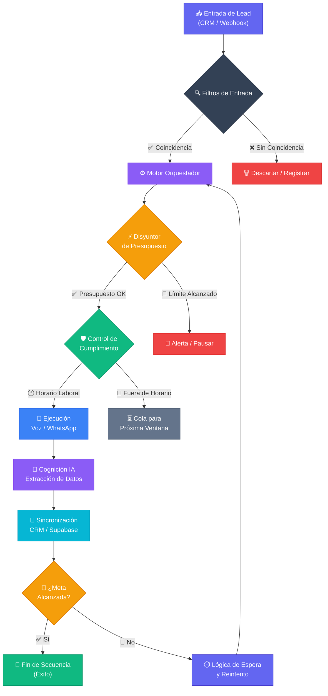

# 📘 Dossier Integral de Entrega: AI CRM & Workflow Orchestrator v5.0

**Estado del Sistema:** Producción / Enterprise Ready
**Departamento:** Arquitectura y Documentación Técnica
**Versión:** 5.0.0 (Unified Node Engine)

---

## 📑 Índice General

1. **Visión Técnica** (SECCIÓN 1)
2. **Arquitectura Backend** (SECCIÓN 2)
3. **Ingeniería de Resiliencia** (SECCIÓN 3)
4. **Centro de Comando (UI)** (SECCIÓN 4)
5. **Referencia Técnica** (SECCIÓN 5)
6. **Seguridad y Soberanía** (SECCIÓN 6)
7. **Estrategias de Conversión** (SECCIÓN 7)
8. **Manual de Supervivencia** (SECCIÓN 8)
9. **Roadmap y Handover** (SECCIÓN 9)
10. **Anexos de Onboarding** (SECCIÓN 10)
11. **Motor de Cualificación** (SECCIÓN 11)
12. **Contratos de API** (SECCIÓN 12)
13. **Plan de Contingencia** (SECCIÓN 13)
14. **Worker Engine (BullMQ)** (SECCIÓN 14)
15. **Gobernanza de IA** (SECCIÓN 15)
16. **GDPR & Compliance** (SECCIÓN 16)
17. **Baja Latencia (<800ms)** (SECCIÓN 17)
18. **Diccionario de Variables** (SECCIÓN 18)
19. **Anatomía del Agente** (SECCIÓN 19)
20. **Enciclopedia de Nodos** (SECCIÓN 20)
21. **Glosario de Módulos** (SECCIÓN 21)
22. **Guía Command Center** (SECCIÓN 22)
23. **Ciclo de Vida del Dato** (SECCIÓN 23)
24. **Optimización de Costes** (SECCIÓN 24)
25. **Handover Humano** (SECCIÓN 25)
26. **Blueprint Maestro** (SECCIÓN 26)

---

## SECCIÓN 1. Visión Técnica y Resumen Ejecutivo

### Unificación Operativa: Front vs Back

El sistema **AI CRM & Workflow Orchestrator v5.0** ha sido diseñado bajo la premisa de la "Ingeniería Invisible". Mientras que el **Frontend** ofrece una interfaz de usuario minimalista y potente (Centro de Comando) para la toma de decisiones basada en datos, el **Backend** (Arquitectura de Soporte) opera como un motor de ejecución de alta disponibilidad capaz de procesar miles de interacciones simultáneas sin intervención humana.

### El Motor de Orquestación de Quinta Generación

A diferencia de los sistemas lineales tradicionales, nuestro **Orchestrator Engine** utiliza una arquitectura de grafos. Esto permite que la lógica de negocio no sea estática, sino adaptativa. Cada "Lead" que ingresa al sistema activa un recorrido único basado en condiciones horarias, respuestas del usuario y análisis de sentimiento en tiempo real realizado por la capa de IA cognitiva.

### Visualización del Flujo Maestro de Datos

---

## SECCIÓN 2. El "Backend": Arquitectura de Soporte e Ingeniería

### Orchestrator Engine: Lógica Nodal Basada en Grafos

El núcleo de la inteligencia del sistema reside en el **Orchestrator Engine**. A diferencia de los CRMs estáticos, este motor procesa cada entrada (Lead) como un objeto dinámico dentro de un grafo de ejecución.

* **Decisión en Tiempo Real:** El motor evalúa el contexto del lead (origen, campaña, hora local) antes de disparar el primer nodo.
* **Asincronía Total:** Utiliza un sistema de colas (Redis/Worker) para asegurar que el escalado de leads no afecte la latencia de respuesta de los agentes de voz.

### Multi-Tenancy y Soberanía de Datos

1. **Aislamiento Lógico:** Cada registro en la base de datos está etiquetado con un `tenant_id` único, protegido por políticas de RLS.
2. **Soberanía de Datos (Supabase Externo):** El sistema permite la conexión a instancias privadas de los clientes, garantizando que sus datos permanecen intactos y bajo su control.

---

## SECCIÓN 3. Ingeniería de Resiliencia y Control (El "Fail-Safe")

### A. Circuit Breaker (Control de Presupuesto)

El motor de ejecución monitoriza el gasto acumulado en APIs cada vez que intenta procesar un paso.

* **Interrupción Automática:** Si el gasto actual iguala o supera el límite, el sistema detiene todas las secuencias activas.

### B. RAG & Knowledge Base (Cerebro Dinámico)

* **PGVector:** Los PDFs subidos se fragmentan e indexan en una base de datos vectorial para inyectar contexto real en el prompt de la IA.

---

## SECCIÓN 4. El "Frontend": Centro de Comando y Control (UI)

### Dashboard de Métricas: Visibilidad ROI

El Dashboard calcula la rentabilidad:
* **KPIs de Rendimiento:** Tasa de contacto y costo por cita.
* **Embudo de Conversión:** Visualización del progreso del lead.

### Workflow Builder: Ingeniería No-Code

Interfaz de arrastrar y soltar (React Flow) para diseñar flujos complejos sin escribir código.

---

## SECCIÓN 5. Manual de Referencia Técnica (Referencia)

| Nodo | Categoría | Función Técnica |
| :--- | :--- | :--- |
| **Lead Trigger** | Disparador | Punto de entrada principal. |
| **AI Voice Agent** | Canal | Llamada saliente utilizando **Retell/Ultravox**. |
| **WhatsApp Messenger** | Canal | Envía plantilla oficial de Meta. |

---

## SECCIÓN 6. Guía de Seguridad y Soberanía

### Blindaje RLS
Cada tabla cuenta con políticas de Row Level Security activas para asegurar que un cliente jamás pueda ver datos de otro.

---

## SECCIÓN 7. Estrategias y Casos de Uso Ganadores

1. **Respuesta Relámpago:** Contactar al lead en los primeros 30s.
2. **Insistencia Inteligente:** Secuencias omnicanal (Voz + WhatsApp).

---

## SECCIÓN 8. Manual de Supervivencia (Troubleshooting)

| Situación | Acción Correctiva |
| :--- | :--- |
| **WhatsApp Error** | Verificar Meta Token en el Admin Panel. |
| **Latencia de Voz** | Revisar logs de Websocket en Retell AI. |

---

## SECCIÓN 9. Protocolo de Handover y Roadmap

Todo el código fuente y flujos son propiedad del cliente. El Roadmap v6.0 incluye integración nativa con HubSpot y análisis de sentimiento avanzado.

---

## SECCIÓN 10. Anexos Técnicos: Onboarding y Escalabilidad

Checklist para desplegar un nuevo Tenant en menos de 15 minutos, incluyendo migración de esquemas SQL.

---

## SECCIÓN 11. Motor de Cognición y Cualificación

### Fact Extraction Service
Uso de **GPT-4o** para normalizar hechos (Estudios, Experiencia) y generar resúmenes ejecutivos automáticos.

---

## SECCIÓN 12. Contratos de Interfaz y API (Data Contract)

Endpoint de ingesta: `POST /api/webhooks/leads`. Payload con nombre, teléfono, email y tenant_id.

---

## SECCIÓN 13. Plan de Contingencia y Observabilidad

Monitoreo de salud vía logs del sistema y Redis/BullMQ Dashboard para asegurar que ningún lead quede atascado.

---

## SECCIÓN 14. Arquitectura de Procesamiento Asíncrono (Worker Engine)

Gestión de colas asíncronas con Redis y BullMQ para manejar picos de tráfico sin degradación de la UI.

---

## SECCIÓN 15. Gobernanza de IA y Versionado de Prompts

Control de variantes A/B y optimización continua de prompts mediante inyección dinámica de contexto.

---

## SECCIÓN 16. Cumplimiento Legal y Ético (GDPR & Compliance)

Gestión de ventanas horarias comerciales y detección automática de opt-outs (palabras clave como "STOP").

---

## SECCIÓN 17. La Joya de la Corona: Realismo IA y Baja Latencia

### Ingeniería <800ms
Stack de Websockets que permite interrupciones naturales y escucha activa, emulando una charla humana real.

---

## SECCIÓN 18. Diccionario de Variables del Sistema

Variables globales como `{{user_name}}`, `{{master_name}}`, y `{{course_info}}` disponibles en todos los nodos.

---

## SECCIÓN 19. Anatomía del Agente de IA y Ciclo de Vida

ADN del Agente: System Prompt, Knowledge Base y Tools (Funciones como agendar cita).

---

## SECCIÓN 20. Enciclopedia de Nodos (The Nodal Encyclopedia)

Referencia técnica completa de todos los Triggers, Lógica, Canales e Inteligencia disponibles en el Builder.

---

## SECCIÓN 21. Glosario de Módulos y Conceptos Clave

Diccionario de términos técnicos: VAD, Circuit Breaker, Round Robin, Sovereign Supabase.

---

## SECCIÓN 22. Guía Detallada del Centro de Comando

Explicación funcional de: Constructor, Agentes AI, Conversaciones y Simulador.

---

## SECCIÓN 23. Ciclo de Vida del Dato y Políticas de Retención

Gobernanza de logs, grabaciones en S3 y purga automática de registros antiguos para mantener el rendimiento.

---

## SECCIÓN 24. Guía de Optimización de Costes (Unit Economics)

Estrategias para balancear el uso de GPT-4o y GPT-4o-mini según la criticidad del paso del flujo.

---

## SECCIÓN 25. Protocolo de Intervención Humana (Handover CRM)

Lógica de traspaso a asesores humanos cuando se detecta un lead cualificado o agendamiento exitoso.

---

## SECCIÓN 26. Blueprint Maestro de Conversión (Esden v5.0)

Diagrama de flujo final que unifica toda la lógica de negocio en una arquitectura nodal de alta disponibilidad.

---
*Este documento es el activo final de entrega para el sistema AI CRM & Workflow Orchestrator v5.0. Diseñado para la excelencia técnica.*
